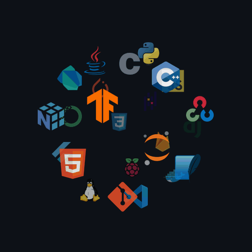

  

#  Hi, I'm Rayan!

Fresh <b>Computer Science</b> graduate from <b>Qassim University</b>, focused on
<b>AI &amp; Machine Learning</b>, <b>Computer Vision</b>, and <b>Software Engineering</b>.
I enjoy the challenge of turning ideas into functional applications that can make a difference.

- Computer Science graduate — Qassim University
- Building with **AI / ML**, **Computer Vision**, and **embedded** systems
- Comfortable across **Python, Java, C/C++, Dart & Flutter**
- Featured work: **AI VISION VIAD** — assistive smart glasses for the visually impaired
- Bilingual interfaces (English / العربية)
- Ask me about computer vision, TensorFlow Lite, or Raspberry Pi projects

  

---

<h2 align="center">🛠️ Tᴇᴄʜ Sᴛᴀᴄᴋ</h2>

<table width="100%">
  <tr>
    <td width="45%" valign="middle" align="center">
      <picture>
        <source media="(prefers-color-scheme: dark)" srcset="./skills-animation.gif" />
        <source media="(prefers-color-scheme: light)" srcset="./skills-animation-light.gif" />
        
      </picture>
    </td>
    <td width="55%" valign="top" align="left">
      

        <b>Areas:</b>&nbsp; 🤖 AI &amp; Machine Learning &nbsp;•&nbsp; 👁️ Computer Vision &nbsp;•&nbsp; 💻 Software Engineering &nbsp;•&nbsp; 📟 Embedded / IoT
      

      <h3>📚 Current Learning</h3>
      <ul>
        <li>Deep learning for vision — model optimization &amp; on-device inference (TensorFlow Lite).</li>
        <li>Sensor fusion &amp; real-time systems on Raspberry Pi.</li>
        <li>Production-grade software engineering &amp; clean architecture.</li>
      </ul>
    </td>
  </tr>
</table>

---

<h2 align="center">🌟 Fᴇᴀᴛᴜʀᴇᴅ Pʀᴏᴊᴇᴄᴛ — AI VISION VIAD 🌟</h2>

<b>VIAD — Visually Impaired Assistive Device</b> 
Wearable AI <b>smart glasses</b> built on a <b>Raspberry Pi</b> that help visually
impaired users perceive their surroundings.

<ul align="left">
  <li>🧠 <b>On-device object detection</b> with <b>TensorFlow Lite</b> + <b>SSD-MobileNet</b>.</li>
  <li>📡 <b>Sensor fusion</b> — detections fused with <b>HC-SR04 ultrasonic</b> distance sensing for obstacle awareness.</li>
  <li>☁️ <b>Cloud assistant</b> powered by <b>Gemini 2.5 Flash</b> for richer scene understanding.</li>
  <li>🗣️ <b>Bilingual voice interface</b> — natural <b>English / Arabic</b> audio feedback.</li>
</ul>

  

---

<h2 align="center">📊 Gɪᴛʜᴜʙ Sᴛᴀᴛs 📊</h2>

<table width="100%">
  <tr>
    <td width="50%">
      

        
      

    </td>
    <td width="50%">
      

        
      

    </td>
  </tr>
</table>

  

---

<h2 align="center">📈 Cᴏɴᴛʀɪʙᴜᴛɪᴏɴ Gʀᴀᴘʜ 📈</h2>

  

---

<h2 align="center">🌟 Tʜᴏᴜɢʜᴛ ᴏғ ᴛʜᴇ Dᴀʏ 🌟</h2>

<!-- QUOTE:START — updated daily by .github/workflows/quote.yml (do not edit between the markers) -->

  

<!-- QUOTE:END -->

---

<h2 align="center">🤝 Cᴏɴɴᴇᴄᴛ Wɪᴛʜ Mᴇ 🤝</h2>

  <a href="https://www.linkedin.com/in/rayan-altwijri" target="_blank">&nbsp;&nbsp;</a>
  <a href="https://github.com/ehrg1" target="_blank">&nbsp;&nbsp;</a>
  <a href="mailto:riansaad23@gmail.com" target="_blank">&nbsp;&nbsp;</a>
  <a href="https://www.instagram.com/ehr.g" target="_blank">&nbsp;&nbsp;</a>
  

  

